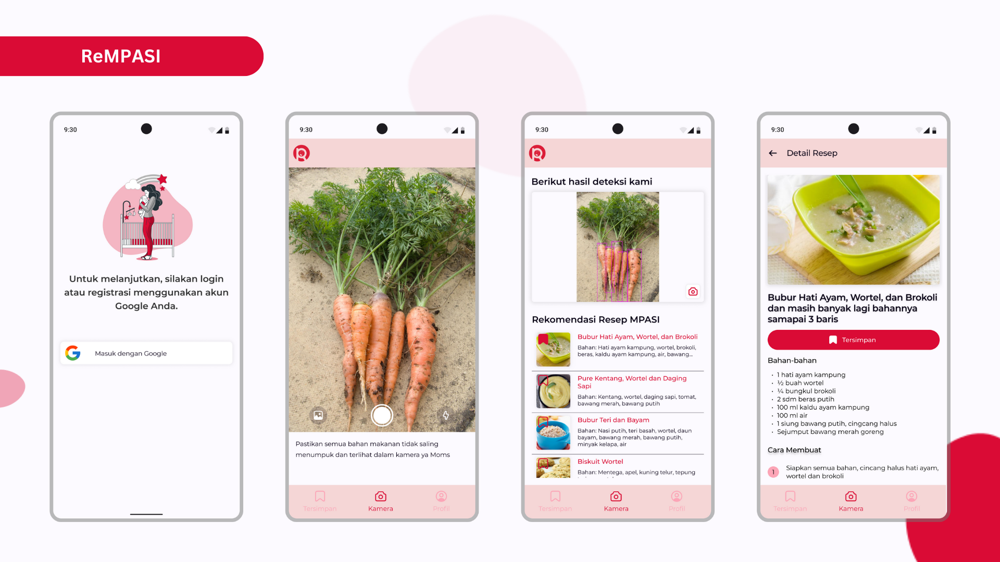
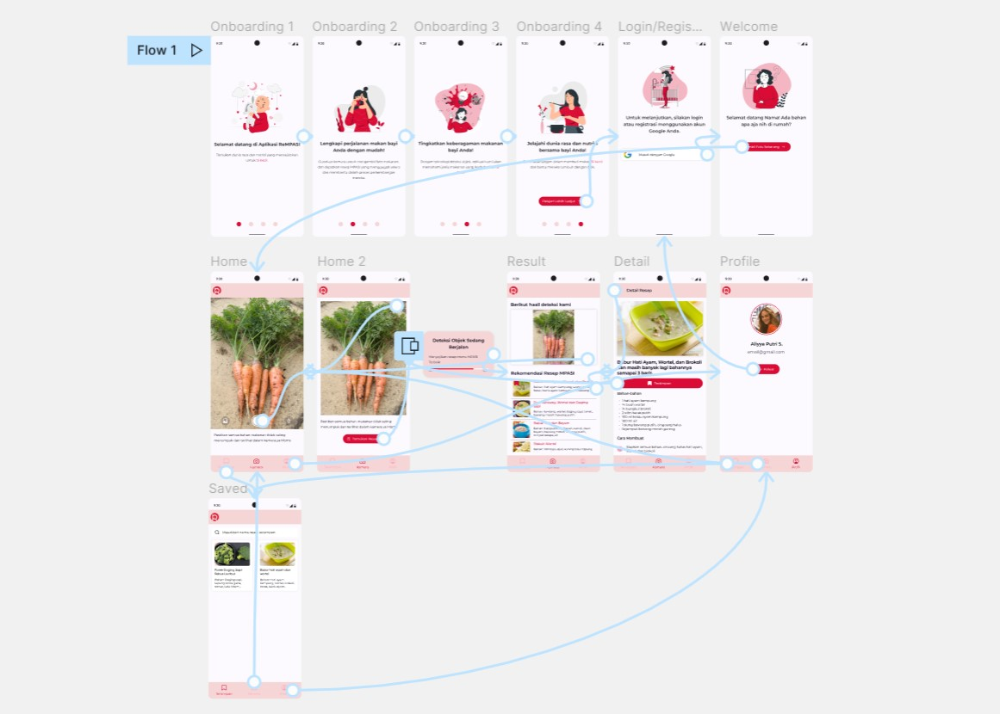

# ReMPASI - Rekomendasi MPASI

## Introduction

ReMPASI is a cutting-edge app designed to empower parents in providing healthy complementary meals for their babies. Its key feature includes an object detection system for baby food ingredients such as vegetables and fruits. Built with Kotlin, Jetpack Compose (M3), Retrofit, and implementing a <a href="https://developer.android.com/topic/architecture">clean architecture</a>.

## Features

- Google Authentication: User authentication using Google accounts for a seamless login experience.
- Object Detection: Detects baby food ingredients, such as vegetables and fruits, using advanced image recognition technology.
- MPASI Recipe Recommendation: Provides recommendations for complementary meal recipes based on the detected ingredients.
- Bookmarked Recipe: Allows users to save MPASI recipes and access them offline for convenient meal planning.

## Figma Design

Here is the link for the [design](https://www.figma.com/file/ZVk6ZyqANqxLx2dHZAaJ0Z/ReMPASI?type=design&node-id=0%3A1&t=JMqR1hicTc5uTCdu-1)

## Library

- [Jetpack Compose (M3)](https://developer.android.com/jetpack/androidx/releases/compose-material3)
- [Retrofit](https://square.github.io/retrofit/)
- [Firebase Auth](https://firebase.google.com/docs/auth)
- [Lifecycle](https://developer.android.com/jetpack/androidx/releases/lifecycle)
- [Pager](https://google.github.io/accompanist/pager/)
- [Navigation](https://developer.android.com/jetpack/compose/navigation)
- [CameraX](https://developer.android.com/jetpack/androidx/releases/camera)
- [Hilt](https://developer.android.com/training/dependency-injection/hilt-android)
- [Room](https://developer.android.com/jetpack/androidx/releases/room)
- [Coil](https://coil-kt.github.io/coil/)
- [Datastore](https://developer.android.com/topic/libraries/architecture/datastore)
- [OKHTTP](https://square.github.io/okhttp/)

## License

Distributed under the GPL-3.0 License. See [LICENSE.txt](LICENSE.txt) for more information.
