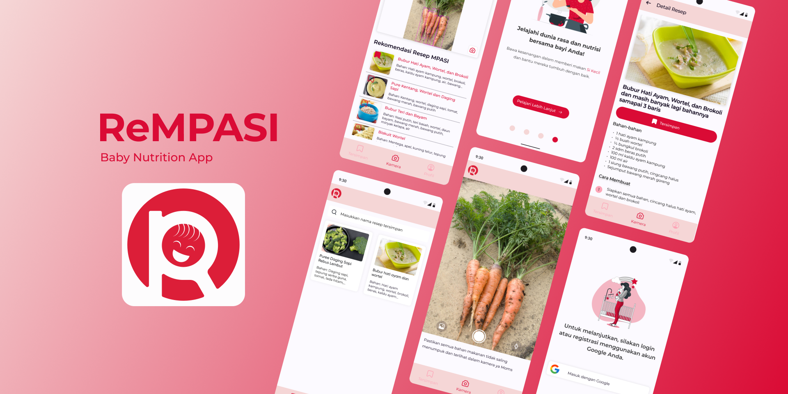

# ReMPASI 👶


An App that lets parents take pictures of their home food ingredients for healthy complementary meal suggestions based on their baby's nutritional requirements and is also expected to have the potential to reduce infant malnutrition.

## Application Demo 📱

<center></center>

## How To Contribute 📝

### 1. Fork First !

You can see of the top right there is a button for forking this repository, so let's start forking by clicking it


### 2. Clone your repository

Clone the forked repository into your local machine, on the part of repository overview, so let's choose


### 3. Create new branch

Do not to forget this step, to create your own branch, type this command on your local VCS

```
git branch <your-branch-name>
```

well, if you wanna more simply way, let's create and move to your own branch by typing

```
git checkout -b <your-branch-name>
```

### 4. Push your work

When you have finished your work, don't forget to push your all the changes into project's repository, first you should go back to the current root folder that you have create before, and type a command for applying changes into staging, like:

```
git add .
```

and then you will type a commit command

```
git commit -m "your commit changes"
```

next, let's push your work

```
git push -u origin <your-branch-name>
```

so if all files compeletly done, you can make a pull request !

### 5. Dealing with PRs

So if you just complete all of those steps, there is a button for making Pull Request (PR), it will be displayed on your ReMPASI forked repo just like this


Okay, after that, scroll down and notice, there is a title field and comment, this is additional, but highly recommended to fill out of your PR title and comments. There is button for submit your Pull Request, and you must click that green colored button


Viola! you have just finished to make a pull request, then be patient to waiting your work, because there is a guy still review all of your changes, just to make sure they're on the right track and the right place :)


So if your PR have been reviewed by maintainer, your PR status might look like this


